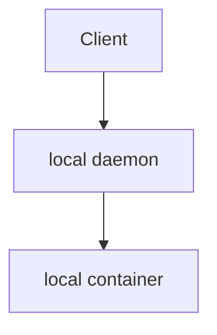
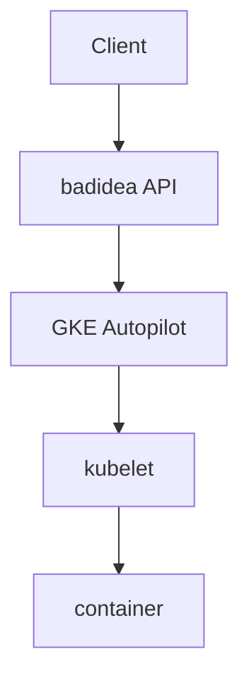

# `badidea`

Proof-of-concept running Docker without privilege, in Kubernetes.

This implements the [Docker TCP API](https://docs.docker.com/engine/api/v1.44/) by creating Pods on a cluster, instead of containers locally.

This is the API that your Docker client uses to talk to your local Docker daemon. It's a JSON REST API that listens on a Unix socket or a TCP port. When run locally, the Daemon creates isolated containers on your host machine. Creating isolated containers requires privilege, which means that unless you take a lot of care to secure your Docker daemon, you're giving anyone who can talk to the Docker API full control of your host machine.

This makes it difficult to run Docker in a multi-tenant environment, like a Kubernetes cluster, where you don't want to give every user full control of the host machine.

This project is a proof-of-concept that shows how you can run Docker in a Kubernetes cluster without giving users full control of host machines. It does this by implementing the same Docker API, but instead of creating containers on the host machine, it creates Pods in the Kubernetes cluster. The Pods that are created are _not privileged_ -- `docker run --privileged` will not be supported -- and can't run Docker themselves, but they can run containers.

If this works (big if), it could be a way to implement autoscaling Docker workloads in unprivileged Kubernetes clusters (like GKE Autopilot), where it looks and acts similar to running Docker locally.

At least, that's the idea.

Normally:



But now:



Besides just including more boxes, this would mean that resources are allocated in the cloud, and clouds have a lot more resources to allocate than most laptops. Since the cluster and the API server both scale to zero when not used, it should also cost ~nothing to run when no containers are running.

The goal is not to replicate all possible features of `docker run` (or Compose, or Swarm), only those that are needed for basic build/test scenarios.

## Status: lol

The service is stubbed out and doesn't do much of anything yet. The Docker API is huge and I'm not going to implement all of it. I'm going to start with the parts that I need to run a container and see how far I get.

The IaC deploys the API service to Cloud Run and connects to a GKE Autopilot cluster, also set up by IaC.

## Running

```
terraform init
terraform apply
```

This will prompt for GCP project and region, and eventually (if all goes well) will output the URL of the Cloud Run service:

```
Outputs:

url = "https://badidea-nd2blahc7a-uk.a.run.app"
```

The API doesn't do any authorization checks, so in order to keep just anybody from running containers in your cluster, we also enforce that requests have a secret header. You can set that in your `~/.docker/config.json`:

```
{
  "auths": {...},
  "httpHeaders": {
    "x-badidea": "true"
  }
}
```

Cloud Run services are only exposed over HTTPS, with certs generated by Let's Encrypt, and the Docker client normally assumes that if you're calling the daemon over HTTPS you're doing it with a self-signed cert, so we'll populate `~/.docker/ca.pem` with the system CA certs.

```
crane export cgr.dev/chainguard/static:latest-glibc - | tar -Oxf - etc/ssl/certs/ca-certificates.crt > ~/.docker/ca.pem
```

```
DOCKER_TLS_VERIFY=1 DOCKER_HOST=tcp://badidea-nd2blahc7a-uk.a.run.app:80 docker version
...
Server: badidea
 Engine:
  Version:
  API version:      1.45 (minimum version )
  Go version:       go1.21.5
  Git commit:       You're not going to believe this...
  Built:
  OS/Arch:          linux/amd64
  Experimental:     true
```

🎉

You can run a container:

```
$ docker run hello-world
unable to upgrade to tcp, received 400
```

(That's a bug, I'm working on it.)

```
$ docker ps
CONTAINER ID   IMAGE         COMMAND   CREATED          STATUS    PORTS     NAMES
badidea-tcl4   hello-world   ""        42 seconds ago   Running             adidea-tcl4x
```

(That's a bug, I'm working on it.)

```
$ docker kill badidea-tcl4x
badidea-tcl4x
```

That works at least 😅

# TODO: draw the rest of the owl

`docker logs`, `docker attach`, `docker exec`, etc. are all on the roadmap. Volumes should be doable, networks probably not easily enough that I'll ever try it.

It might be possible to implement `docker build` (the buildkit API) -- snapshotting the containers will be the tricky part.

# Acknowledgements

- This work was inspired by https://github.com/wlynch/levias which runs containers in a cluster using ephemeral containers
- The name "badidea" was inspired by https://github.com/thetirefire/badidea which is like a Kubernetes API without containers (similar to [`kcp`](https://github.com/kcp-dev/kcp))

