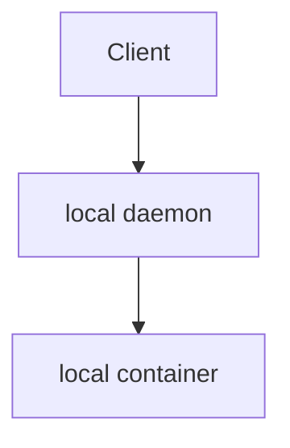
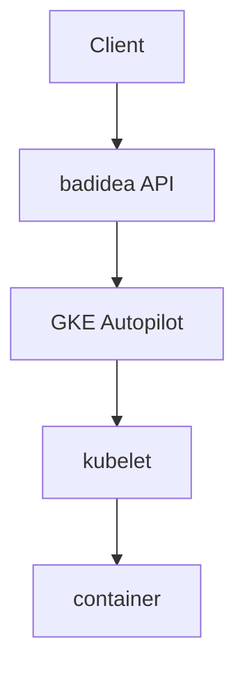

# `badidea`

Proof-of-concept running Docker without privilege, in Kubernetes.

This implements the [Docker TCP API](https://docs.docker.com/engine/api/v1.44/) by creating Pods on a cluster, instead of containers locally.

This is the API that your Docker client uses to talk to your local Docker daemon. It's a JSON REST API that listens on a Unix socket or a TCP port. When run locally, the Daemon creates containers on your host machine. Creating containers requires privilege, which means that unless you take a lot of care to secure your Docker daemon, you're giving anyone who can talk to the Docker API full control of your host machine.

This makes it difficult to run Docker in a multi-tenant environment, like a Kubernetes cluster, where you don't want to give every user who happens to be running a workload on a node full control of that node, where other users might be running.

This project is a proof-of-concept that shows how you can run Docker in a Kubernetes cluster without giving users full control of host machines. It does this by implementing the same Docker API, but instead of creating containers on the host machine, it creates Pods in the Kubernetes cluster. The Pods that are created are _not privileged_ -- `docker run --privileged` will not be supported -- and can't run Docker themselves, but they can run inside a container.

If this works (big if), it could be a way to implement autoscaling Docker workloads in unprivileged Kubernetes clusters (like GKE Autopilot), where it looks and acts similar to running Docker locally.

At least, that's the idea.

Normally:


```mermaid
flowchart
    Client --> D[local daemon]
    D --> E[local container]
```

But now:


```mermaid
flowchart
  Client --> A[badidea API]
  A --> K[GKE Autopilot]
  K --> B[kubelet]
  B --> C[container]
```

Besides just including more boxes, this would mean that resources are allocated in the cloud, and clouds have a lot more resources to allocate than most laptops. Since the cluster and the API server both scale to zero when not used, it should also cost ~nothing to run when no containers are running.

The goal is not to replicate all possible features of `docker run` (or Compose, or Swarm), only those that are needed for basic scenarios.

## Status: lol

The service supports basic containers, volumes, and some network configuration, as well as `docker cp`. The Docker API is huge and I'm not going to implement all of it. I'm going to start with the parts that I need to run a container and see how far I get.

## "Authorization checks"

The API doesn't do any authorization checks, so in order to keep just anybody from running containers in your cluster, we also enforce that requests have a secret header. You can set that in your `~/.docker/config.json`:

```
{
  "auths": {...},
  "httpHeaders": {
    "x-badidea": "true"
  }
}
```

This tells your `docker` client to send this header to the server on every request

## Running locally with [KinD (Kubernetes-in-Docker)](https://kind.sigs.k8s.io/) 🐢

```
kind create cluster
kind get kubeconfig > /tmp/kubeconfig
KUBECONFIG=/tmp/kubeconfig go run ./
export DOCKER_HOST=tcp://localhost:8080
```

This will start the local server. Next, connect to it:

```
$ docker version
...
$ docker run --rm hello-world
...
$ docker ps
CONTAINER ID   IMAGE         COMMAND   CREATED          STATUS      PORTS     NAMES
bad-tk7th      hello-world   ""        14 seconds ago   Succeeded             bad-tk7th
```

This demonstrates a needlessly circuitous way to run Docker containers locally! 🎉

## Running in GCP

Running locally isn't fun, let's run our containers in the cloud:

```
terraform init
terraform apply
```

The IaC deploys the API service to Cloud Run and connects to a GKE Autopilot cluster, also set up by IaC.

This will prompt for GCP project and region, and eventually (if all goes well) will output the URL of the Cloud Run service:

```
Outputs:

url = "https://badidea-<something>-uk.a.run.app"
```

Cloud Run services are only exposed over HTTPS, with certs generated by Let's Encrypt, and the Docker client normally assumes that if you're calling the daemon over HTTPS you're doing it with a self-signed cert, so we'll populate `~/.docker/ca.pem` with system CA certs.

```
crane export cgr.dev/chainguard/static:latest-glibc - | tar -Oxf - etc/ssl/certs/ca-certificates.crt > ~/.docker/ca.pem
```

```
$ export DOCKER_TLS_VERIFY=1
$ exportDOCKER_HOST=tcp://badidea-<something>-uk.a.run.app:80 docker version
$ docker version
...
$ docker run --rm hello-world
...
$ docker ps
CONTAINER ID   IMAGE         COMMAND   CREATED          STATUS      PORTS     NAMES
bad-tcl4x      hello-world   ""        18 seconds ago   Succeeded             bad-tcl4x
```

🎉

This ran a container as a Pod on the GKE Autopilot cluster you created, talking to the Docker API on Cloud Run, and the `docker` CLI was none the wiser.

# Acknowledgements

- This work was inspired by https://github.com/wlynch/levias which runs containers in a cluster using ephemeral containers
- The name "badidea" was inspired by https://github.com/thetirefire/badidea which is like a Kubernetes API without containers (similar to [`kcp`](https://github.com/kcp-dev/kcp))

